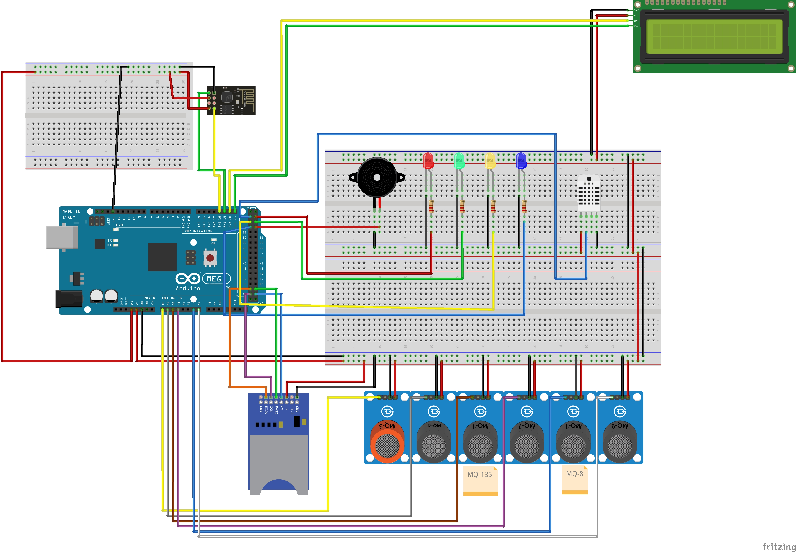

# J3M
---

O `J3M` é um projeto desenvolvido como um `TCC` na Universidade Presbiteriana Mackenzie por alunos do curso de Sistemas de Informação e Ciências da Computação.
Seu objetivo é medir alguns gases, temperatura e umidade, para isso conta com sensores que o permite realizar essas métrias e fazer o envio das mesmas para uma `API` para posteriormente serem apresentadas em um `Dashboard` ou algo do tipo.

### Componentes
---

- `Arduino Mega`: O `Arduino` que recebe os dados dos sensores e prepara para serem enviados a `API`.
- `SIM800L`: Módulo de cartão SIM que faz o envio dos dados obtidos pelo `Arduino` para a `API`.
- `Leitor de Cartão Micro SD`: Também conhecido como leitor de cartão de memória, onde fica o arquivo de configurações (Presente na raiz desse projeto, vide o arquivo `config.txt`), esse arquivo é lido e configura algumas coisas como `IP`/`Host` da `API` e `ID` do dispositivo.
- `Buzzer`: Responsável por emitir avisos sonoros através de beeps caso haja algum erro no cartão SD.
- `LEDs`:
    - `Vermelho`: Indica que houve algum erro no cartão SD (Piscada a cada 1 segundo, erro ao ler o conteúdo do arquivo de configurações. Piscada a cada 2 segundos, erro ao inicializar o cartão SD. Piscada a cada 3 segundos, Erro ao abrir o arquivo de configurações.).
    - `Amarelo`: Indica que os sensores `MQ` estão em processo de calibragem.
    - `Verde`: Indica que a métrica foi efetuada e enviada a `API` (Somente 1 piscada de 1 segundo).
    - `Azul` Indica que está enviando uma requisição `HTTP` para a `API` (Permanece ligado durante todo o envio da requisição).
- `Resistores de 220 Ohms`: Para diminuir um pouco a alimentação dos `LEDs`, para não correr o risco de queimar os mesmos.
- `Lm2596`: Uma fonte de stepdown para alimentar o módulo `SIM800L`, (Pois o módulo só pode operar com tensão entre `3.4v` e `4.4v`), essa fonte foi regulada para `4.2v` para uso nesse projeto.
- `Fonte de 7v a 12v`: A fonte para alimentar o módulo `SIM800L` através do `Lm2596` deve conter de `7v a 12v` e também ser uma fonte de `2A`, pois o módulo necessita dessa corrente para pleno funcionamento. (Para esse projeto, foi utilizada uma fonte de `9v` e `2A`).
- `DHT22`: Responsável por medir a temperatura e a umidade do ambiente.
- `MQ3`: Responsável por medir o álcool, benzeno e hexano no ambiente.
- `MQ4`: Responsável por medir o metano e fumaça no ambiente.
- `MQ135`: Responsável por medir o dióxido de carbono, tolueno, amônia e acetona no ambiente.
- `MQ7`: Responsável por medir o monóxido de carbono no ambiente.
- `MQ8`: Responsável por medir o hidrogênio no ambiente.
- `MQ9`: Responsável por medir gases inflamáveis no ambiente.
- `LCD 1602A + I2C`: Exibe as mensagens para quem estiver utilizando o `J3M` saiba o que o sensor está fazendo, sendo um complemento para os `LEDs`.

### Bibliotecas Utilizadas
---

As bibliotecas utilizadas para desenvolver esse projeto estão dentro da pasta `bibliotecas`.

### Esquemático do Projeto
---

Aqui encontra-se como o projeto foi e como deve ser montado:

### Estrutura das Métricas
---

Os sensores `MQ3`, `MQ4`, `MQ135`, `MQ7`, `MQ8` e `MQ9` efetuam as métrias dos gases em `ppm`.
O sensor `DHT22` efetua a métrica da temperatura em `ºC` e umidade do ar em `Percentual`.
